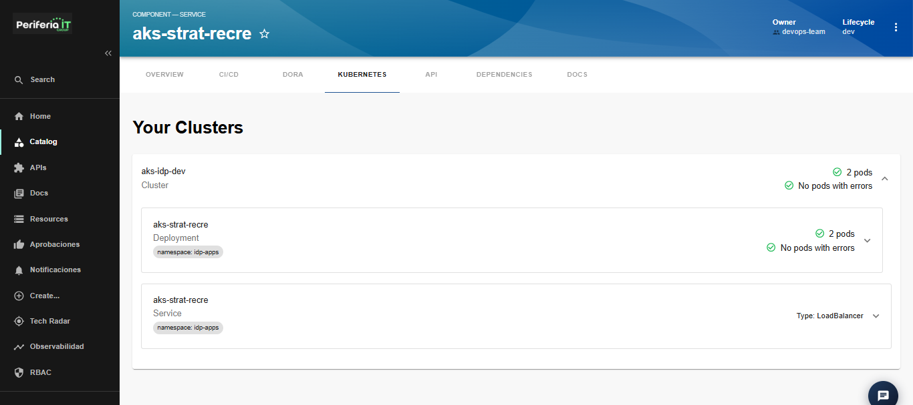
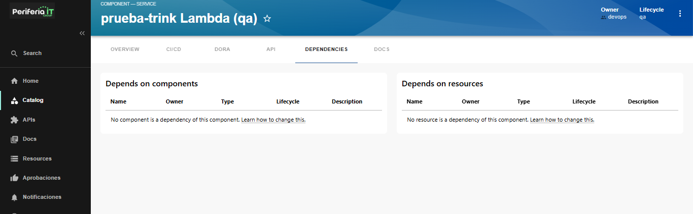
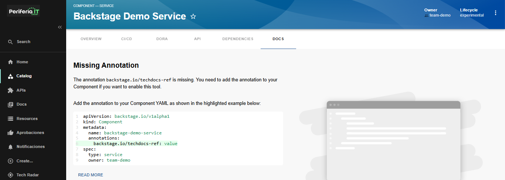
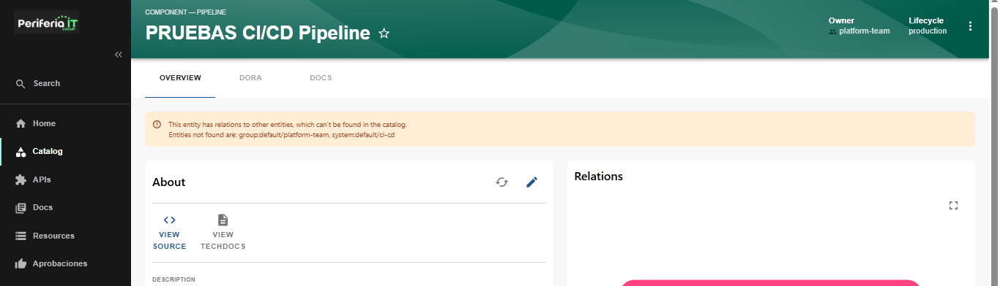
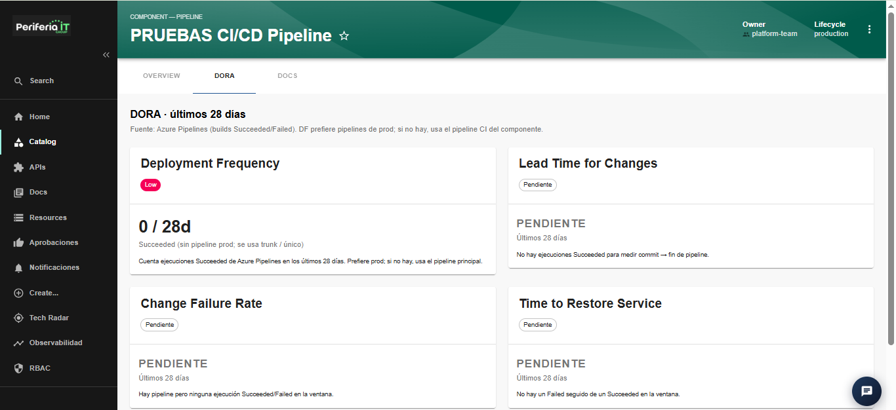
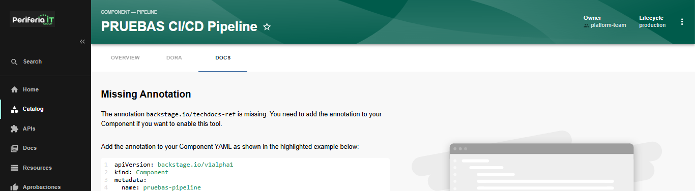

## seccion Catalog

En esta seccion se enlista todos los componentes ya creados.En estos se ve propiedades de NAME SYSTEM OWNER TYPE LIFECYCLE DESCRIPTION. Seleccionar un componente da vistas diferentes dependiendo del componente.

### NAME (Nombre de componente) - _Website, Service, etc._
#### Overview

Al seleccionar 'NAME', muestra una vista general del componente/servicio seleccionado. En sus propiedades muestra la opcion para ir al origen y ver documentacion.

#### CI/CD

En el apartado de CI/CD se visualiza las ejecuciones de pipelines dentro de la plataforma en la que se encuentre el componente. Es necesario tener una anotacion del componente si se quiere habilitar CI/CD en el componente

#### DORA

Este Apartado muestra las metricas DORA que se tiene en el monitoreo de este proyecto. separado en las 4 metricas principales (_Deployment Frequency_, _Lead Time for Changes_, _Change Failure Rate_, _Time to Restore Service_)

#### KUBERNETES

En este apartado, se muestran el cluster de kubernetes relacionado a el componente con los tipos de servicios que tenga.

#### API

En esta seccion muestra un resumen de consumos de API por parte del componente. Se encuentra separado por dos resumenes. APIs aprovisionadas y APIs Consumidas

Seleccionar una API mostrara los detalles (OVERVIEW) de la misma.

##### Overview de API - Catalog

En esta vista se ven las propiedades de la API y a componente esta conectada en **Relations**

##### Definition de API - Catalog

En la seccion 'DEFINITION' de la vista API dentro de catalog, se muestra la salud de la API relacionada a el componente seleccionado en Catalog. Se muestra tanto la vitsa de OpenAPI y RAW: 

#### DEPENDENCIES

En este apartado se muestra las relaciones que tiene el servicio con librerias o dependencias. Si no tiene niguna, es esta vista se confirmara que no tiene ninguna relacion de dependencias.

#### DOCS

En el apartado DOCS se muestra documentacion relacionada a el componente o servicio que halla seleccionado

si no se tiene ninguno, se indicara que falta una anotacion para que se relacione la documentacion con el componente

### NAME (Nombre de componente) - _pipeline_

Para los componentes que son tipo pipeline se visualizan las propiedades: 'OVERVIEW','DORA' y 'DOCS'

#### Overview

Al seleccionar el pipeline en la seccion 'NAME', muestra una vista general del componente/servicio seleccionado. En estas propiedades muestra la opcion para ir al origen y ver documentacion.

#### DORA

Este Apartado muestra las metricas DORA que se tiene en el monitoreo de este proyecto. separado en las 4 metricas principales (_Deployment Frequency_, _Lead Time for Changes_, _Change Failure Rate_, _Time to Restore Service_)

#### DOCS

En el apartado DOCS se muestra documentacion relacionada a el componente o servicio que halla seleccionado

si no se tiene ninguno, se indicara que falta una anotacion para que se relacione la documentacion con el componente

### SYSTEM

En esta columna, se indica de que componente de plataforma se trata el mismo de la fila

### OWNER

En esta columna, se muestra el dueño o cuenta asignada a el componente.

### ACTIONS

En 'ACTIONS' IDP permite ser redirigido a el recurso en si de forma directa ya sea que este en Azure o AWS

Seleccionar un elemento que se tenga en el catalog dara una vista avanzada con propiedades del mismo. en esta vista tambien se tienen las acciones que redirigen a el recurso en si en la plataforma que se encuentre:

