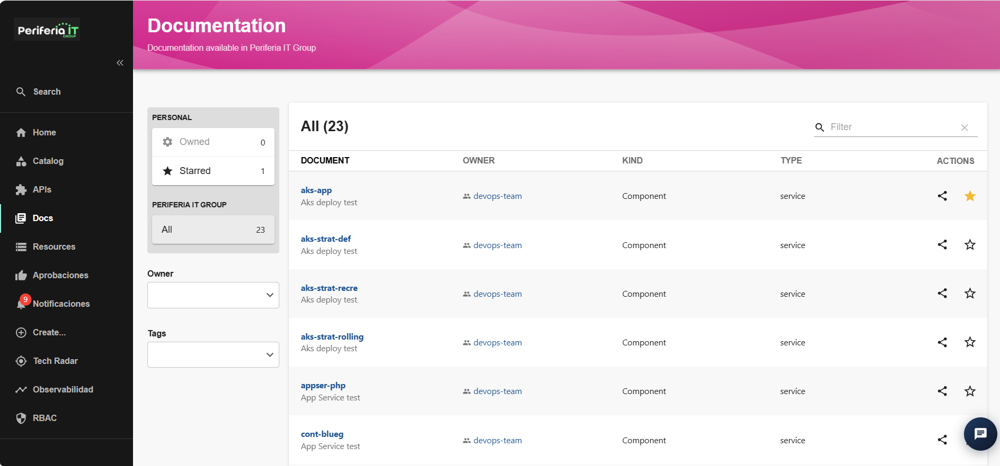
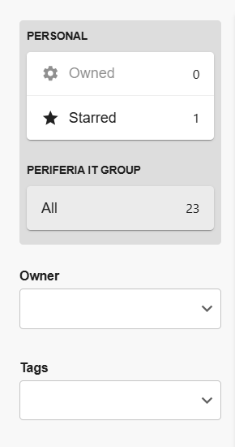
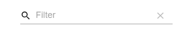
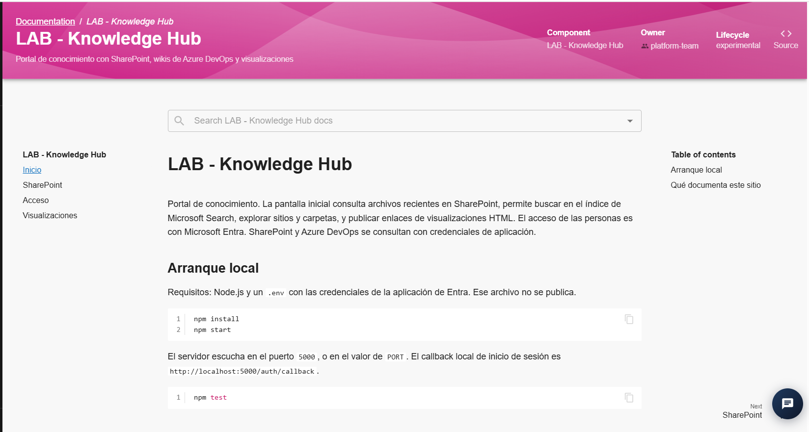
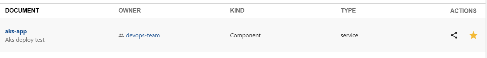

## seccion Docs

La sección Docs permite consultar y acceder a la documentación asociada a los diferentes componentes registrados en el IDP. Desde esta sección se puede visualizar el listado de documentos disponibles y consultar información básica como el nombre del documento, su propietario, el tipo de componente al que pertenece y el tipo de documentación.

La sección también permite localizar documentación mediante los filtros disponibles y acceder directamente al contenido de cada documento.

### Visualización de la documentación

Al ingresar a la sección **Docs**, se muestra el listado de documentos disponibles en el IDP. Para cada documento se puede visualizar información como:

- **Document:** nombre del documento o componente al que está asociado.
- **Owner:** usuario, equipo o grupo responsable del componente.
- **Kind:** tipo de entidad a la que pertenece la documentación.
- **Type:** tipo de componente documentado.
- **Actions:** acciones disponibles sobre el documento.

En la parte izquierda se encuentran diferentes opciones para organizar y filtrar la información:

- **Owned:** permite visualizar la documentación asociada a elementos que pertenecen al usuario.
- **Starred:** permite consultar los documentos que han sido marcados como favoritos.
- **All:** muestra todos los documentos disponibles.
- **Owner:** permite filtrar la documentación de acuerdo con su propietario.
- **Tags:** permite filtrar los documentos mediante las etiquetas asociadas.

En la parte superior del listado se encuentra el campo **Filter**, que permite realizar búsquedas dentro de los documentos disponibles.

### Consulta de un documento

Para consultar la documentación de un componente:

1. Ingresar a la sección **Docs**.
2. Localizar el documento mediante el listado, el buscador o los filtros disponibles.
3. Seleccionar el nombre del documento.
4. El IDP mostrará la documentación asociada al componente.
5. Desde esta vista se puede consultar la información y contenido disponible para el componente seleccionado.

### Acciones disponibles

En la columna **Actions** se encuentran las acciones disponibles para cada documento. Estas opciones permiten realizar operaciones como:

- Copiar o compartir el enlace de documentación.
- Marcar o desmarcar el documento como favorito.
