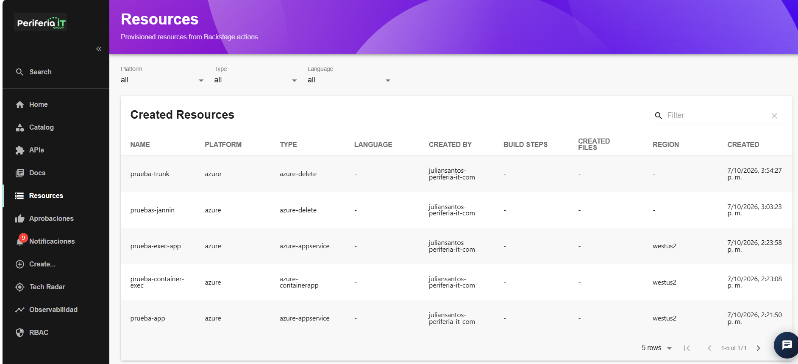
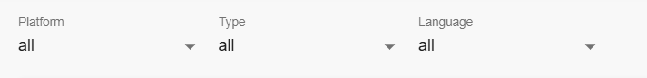

## seccion Resources

La sección **Resources** permite consultar de forma centralizada los recursos que han sido creados y aprovisionados mediante el IDP. Desde esta sección, los colaboradores pueden visualizar información general de los recursos y utilizar diferentes filtros para localizar aquellos que necesiten consultar.

En el listado se presenta información relacionada con cada recurso, como:

- **Name:** nombre asignado al recurso.
- **Platform:** plataforma o proveedor de nube donde se encuentra el recurso, por ejemplo, Azure o AWS.
- **Type:** tipo de recurso creado.
- **Language:** lenguaje asociado al recurso, cuando esta información se encuentra disponible.
- **Created By:** usuario que realizó la creación del recurso.
- **Build Steps:** pasos de construcción asociados al recurso, cuando aplican.
- **Created Files:** archivos generados durante el proceso de creación, cuando aplican.
- **Region:** región donde se encuentra desplegado el recurso, cuando aplica.
- **Created:** fecha y hora en la que se realizó la creación del recurso.

### Búsqueda de recursos

La sección **Resources** cuenta con un campo de búsqueda que permite localizar un recurso específico dentro del listado.

Para realizar una búsqueda:

1. Ingresar a la sección **Resources**.
2. Ubicar el campo **Filter** en la parte superior derecha del listado.
3. Ingresar el nombre o criterio de búsqueda.
4. Verificar que el listado se actualice de acuerdo con el criterio ingresado.
5. Para eliminar la búsqueda, limpiar el contenido del campo **Filter**.

### Filtrado de recursos

Además de la búsqueda, Resources dispone de filtros que permiten consultar los recursos de acuerdo con diferentes características.

Los filtros disponibles son:

- **Platform:** permite filtrar los recursos según la plataforma o proveedor de nube.
- **Type:** permite filtrar los recursos según el tipo de recurso.
- **Language:** permite filtrar los recursos de acuerdo con el lenguaje asociado, cuando este se encuentra registrado.

Para aplicar un filtro:

1. Ingresar a la sección **Resources**.
2. Seleccionar el criterio que se desea consultar.
3. Elegir el valor correspondiente en el filtro.
4. Verificar que el listado se actualice mostrando los recursos que cumplen con el criterio seleccionado.
5. Para consultar nuevamente todos los recursos, limpiar los filtros aplicados.