_Manual de uso comercial y para uso interno de comprension para los colaboradores_

se realizara recorrido de seccion por seccion de la vista general del IDP y se anota paso a paso de como funciona cada seccion (si se requiere)

## seccion HOME

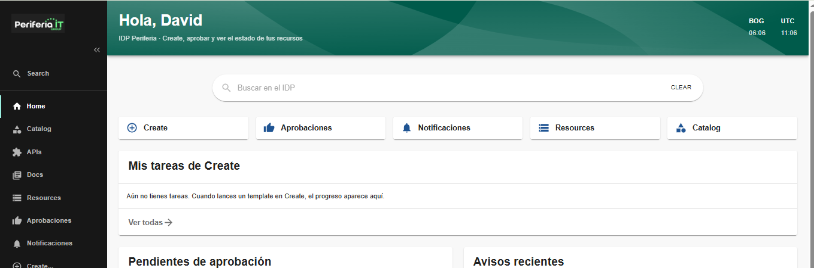

Es una seccion de vista general del IDP. en este, se pueden ver novedades que se tengan de los. En este se pude observar un resumen de las secciones. Se tiene aprobaciones para que se enlace directamente desde acaa por si las microservicios la

## seccion Catalog

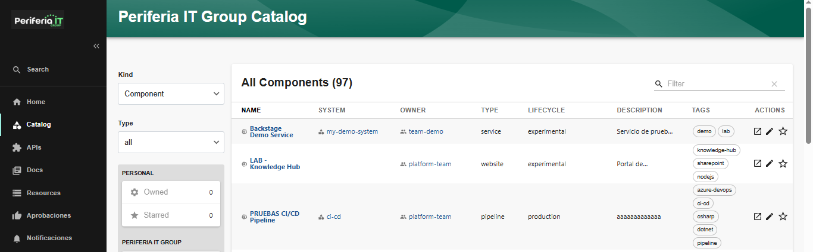

En esta seccion se enlista todos los componentes ya creados. se ve propiedades de NAME SYSTEM OWNER TYPE LIFECYCLE DESCRIPTION 

### NAME
#### Overview

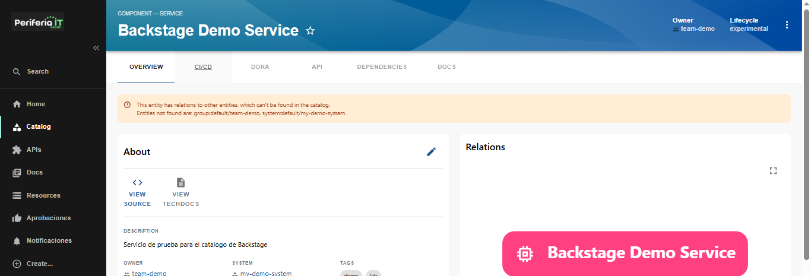

Al seleccionar 'NAME', muestra una vista general del componente/servicio seleccionado. En sus propiedades muestra la opcion para ir al origen y ver documentacion.

#### CI/CD

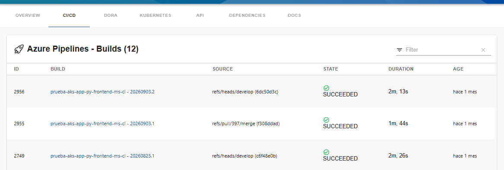

En el apartado de CI/CD se visualiza las ejecuciones de pipelines dentro de la plataforma en la que se encuentre el componente. Es necesario tener una anotacion del componente si se quiere habilitar CI/CD en el componente

#### DORA

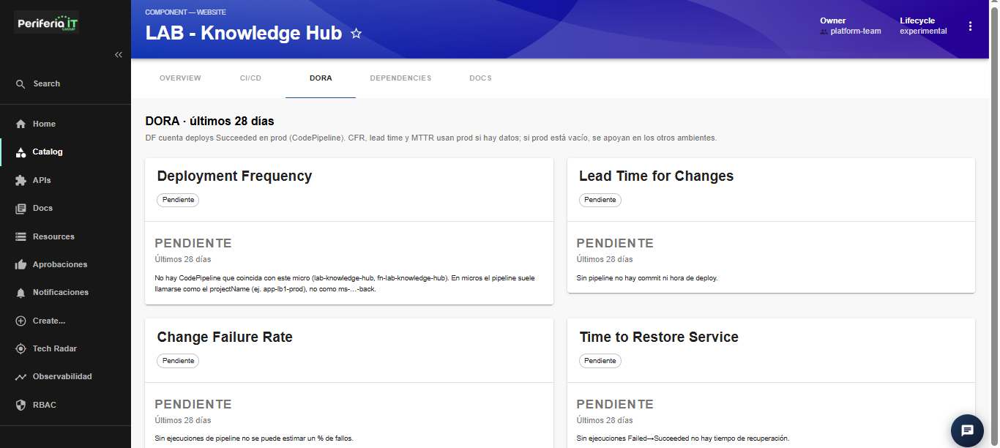

Este Apartado muestra las metricas DORA que se tiene en el monitoreo de este proyecto. separado en las 4 metricas principales (_Deployment Frequency_, _Lead Time for Changes_, _Change Failure Rate_, _Time to Restore Service_)

#### API

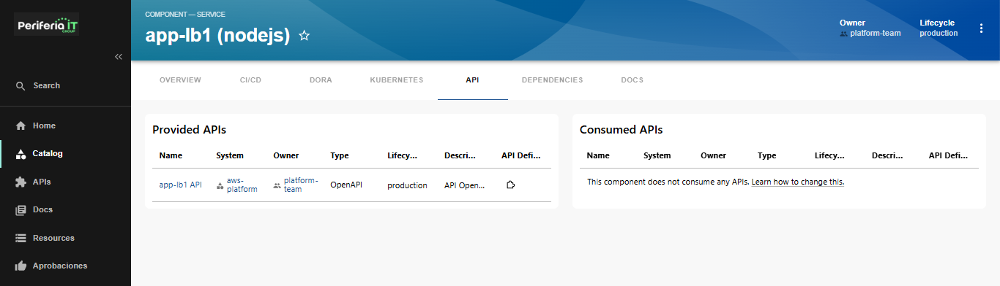

En esta seccion muestra un resumen de consumos de API por parte del componente. Se encuentra separado por dos resumenes. APIs aprovisionadas y APIs Consumidas

Seleccionar una API mostrara los detalles (OVERVIEW) de la misma.

##### Overview de API - Catalog

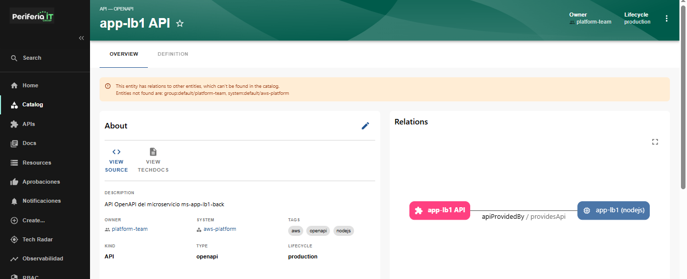

En esta vista se ven las propiedades de la API y a componente esta conectada en **Relations**

##### Definition de API - Catalog

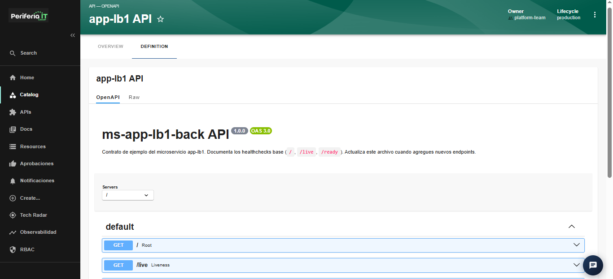

En la seccion 'DEFINITION' de la vista API dentro de catalog, se muestra la salud de la API relacionada a el componente seleccionado en Catalog. Se muestra tanto la vitsa de OpenAPI y RAW: 

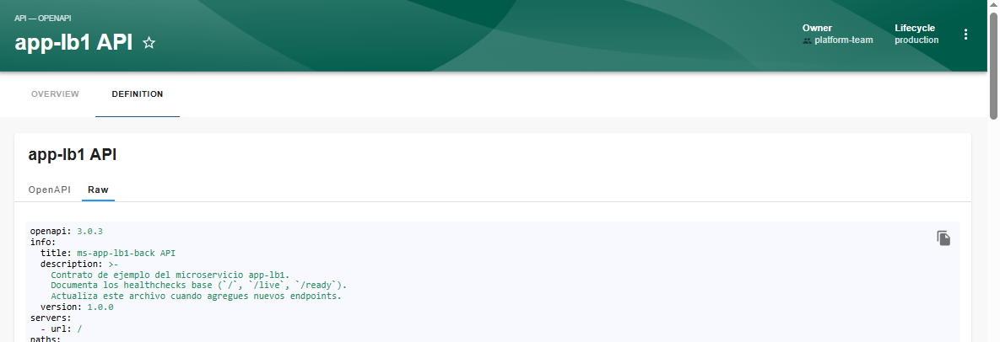

### ACTIONS

En 'ACTIONS' IDP permite ser redirigido a el recurso en si de forma directa ya sea que este en Azure o AWS

Seleccionar un elemento que se tenga en el catalog dara una vista avanzada con propiedades del mismo. en esta vista tambien se tienen las acciones que redirigen a el recurso en si en la plataforma que se encuentre:

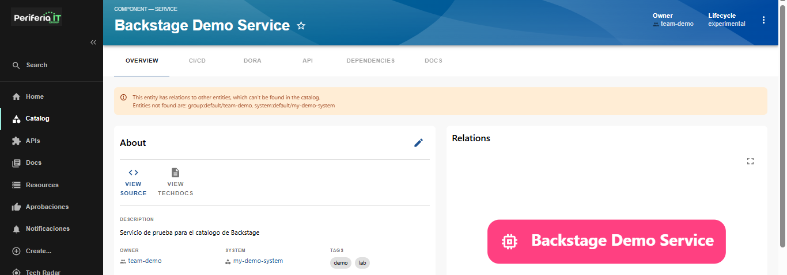

## seccion APIs

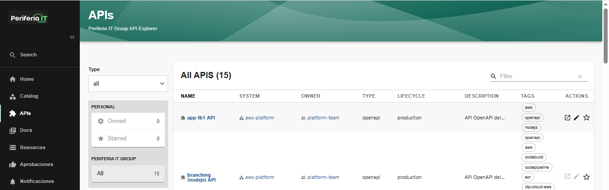

La seccion de APIs es una vista general que se tiene de las APIs que se tengan activas. se puede ver en que plataforma esta, quien es el dueño, su tipo, de que ambiente consiste o que parte de SDLC pertenece, tags y en la columna ACTIONS es para ver o editar la API ya de forma directa en la plataforma que se encuentra

Seleccionar un elemento que se tenga en el catalog dara una vista avanzada con propiedades del mismo. en esta vista tambien se tienen las acciones que redirigen a el recurso en si en la plataforma que se encuentre:

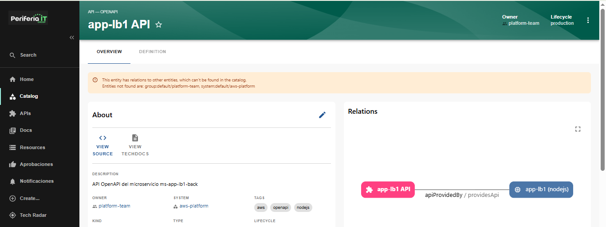

## seccion Docs

## seccion Resources

## seccion aprobaciones

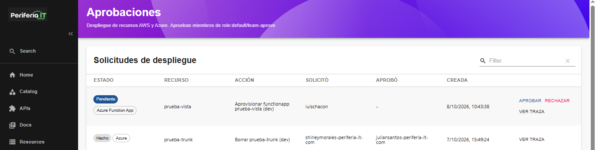

## section notificaciones

## seccion create

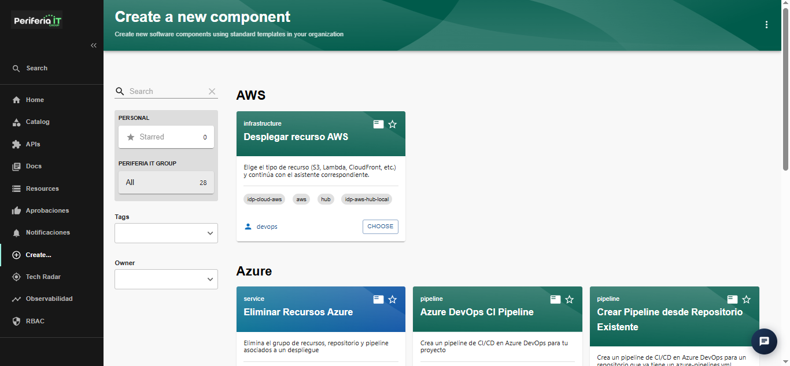

En esta seccion se tienen los templates disponibles para la aplciacion de infraestructura que ofrece IDP. En azure se puede observar cada recuso que puede desplegar en cada template y se visualiza en cada una de las tarjetas de esta vista: 

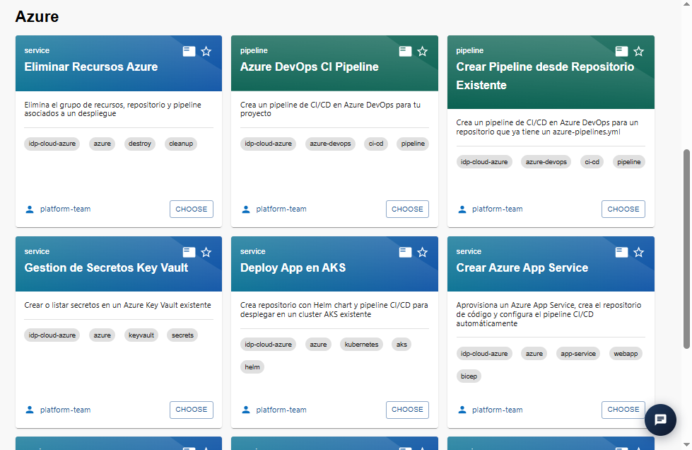

Para AWS se tiene centralizado todos los servicios que puede instanciar IDP en una sola tarjeta:

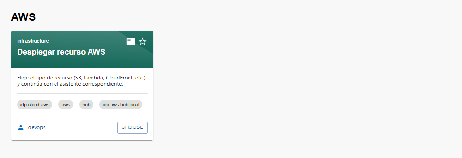

seleccionando es opcion se pide seleccionar el tipo de recurso y este lo redirija a el asistente correspondiente: 

### AWS S3 Bucket

Esta opcion genera el bucket en AWS, su stack de Terraform en el repo IaC (GitHub o AWS CodeCommit, dev/qa/prod) y hace push. Cada bucket tiene carpeta y state propios.

#### paso 1: Origen de repositorios
##### Repositorio IaC en CodeCommit

En el primer paso se solicita relacionar la region de ubicacion del Repositorio IaC dentro de CodeCommit

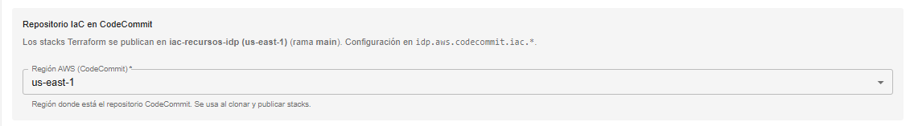

##### Plantillas Terraform en CodeCommit

Ademas, se debe indicar la region donde se encuentra ubicado el repositorio con el template terraform dentro de AWS:

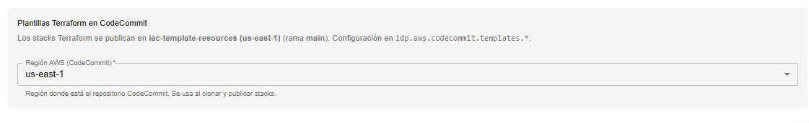

_para pasar al siguiente paso, selecionar 'next'_

#### paso 2: Configuracion general

En este paso se indica propiedades adicionales al bucket. Se relzaiona un nombre el ambiente que se requere. Dependiendo del ambiente, IDP asignara de forma automatica un prefijo dependiendo de que ambiete se haya seleccionado 

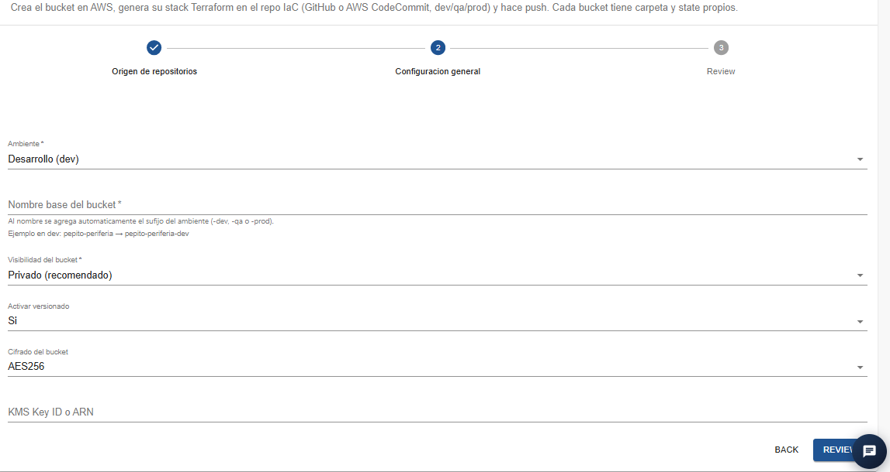

para pasar al siguiente paso, selecionar 'PREVIEW'

#### paso 3: Review

En esta vista, es un resumen de lo indicado en pasos anteriores y que mas propiedades va a tener el bucket a crear

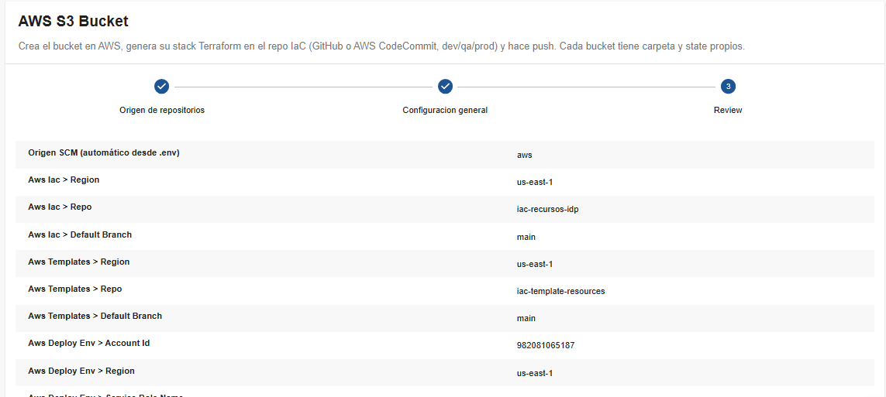

_para hacer que la utilidad proceda se selecciona 'CREATE'

### AWS S3 Bucket — Actualizar

Esta opcion es para realizar modifiacion en un bucket de S3 ya existente. Hace cambios en el versionado, la visibilidad e cifrado del bucket usando stack Terraform en un repo IaC. Al Hacer push, por medio de  GitHub Actions, aplica solo ese stack. 

#### paso 1: Origen del repositorio IaC

en el paso uno se debe indicar la region donde esta ubicado el repositorio IaC en CodeCommit del stack de terraform

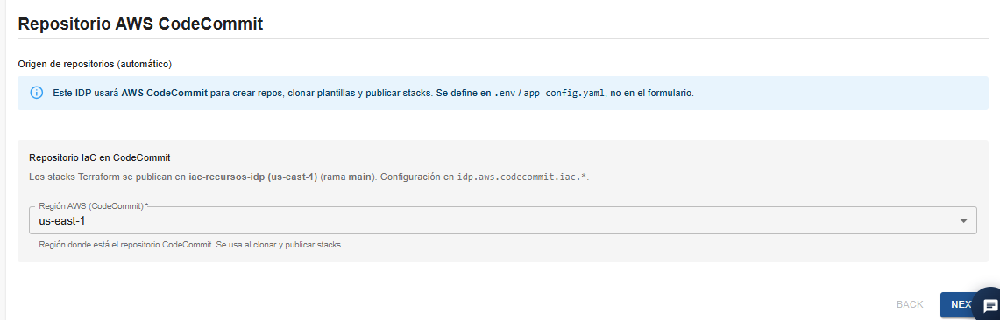

#### Paso 2: Bucket a actualizar

En este paso, se selacciona el bucket a modificar de la lista desplegable y se permite modificar los datos que se ven en el formulario (Nombre del bucket - editable, visibilidad activar versionado cifrado del bucket y algun identifcador unico en caso de ser necesario.)

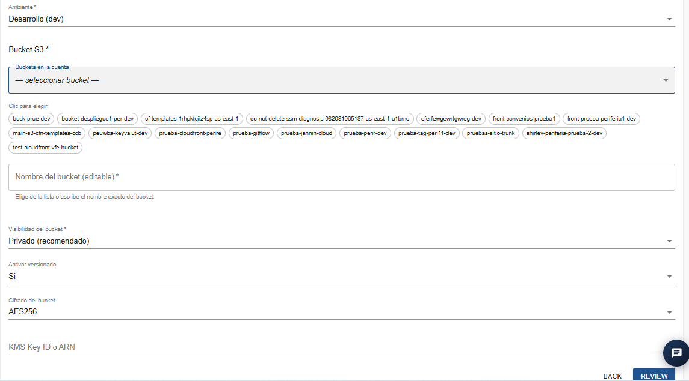

## section tech radar